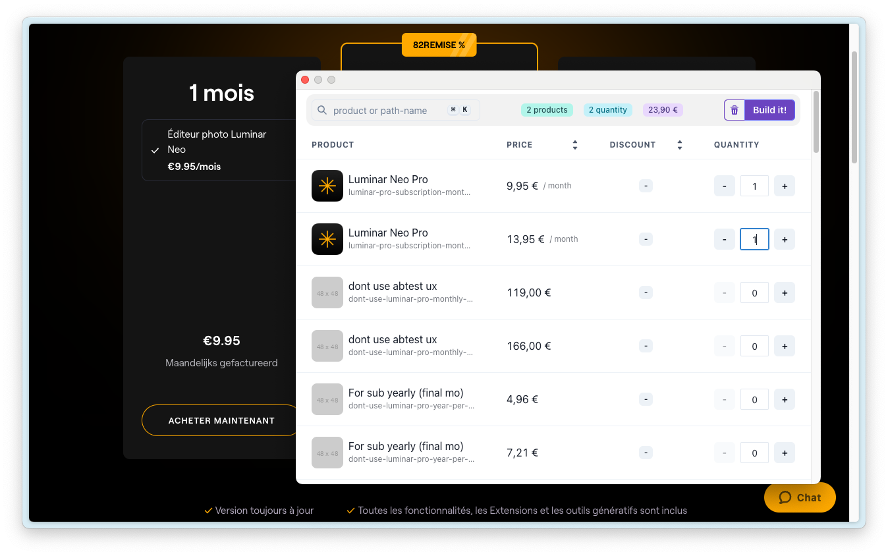
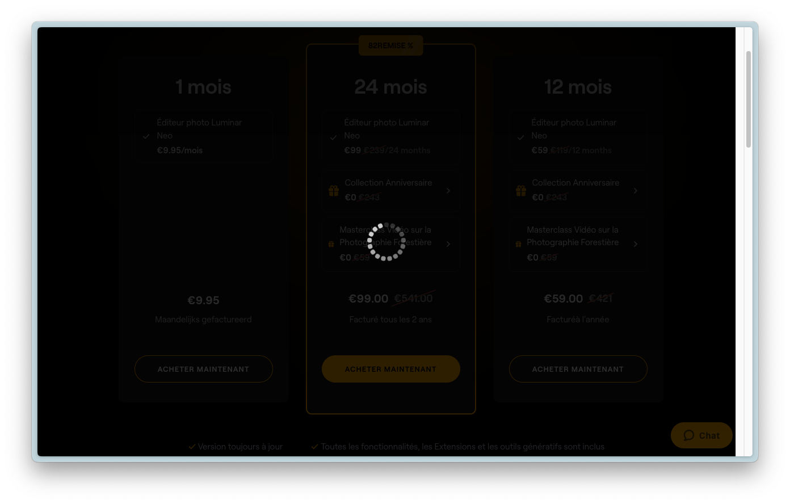
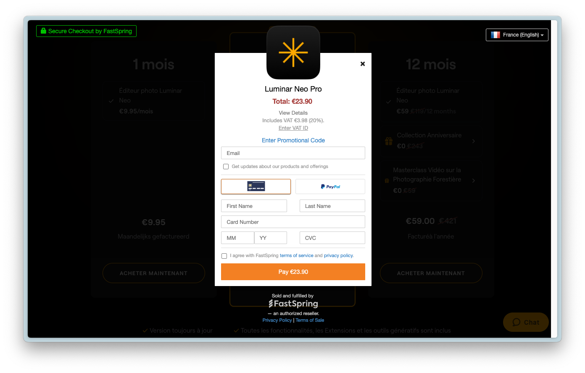

# Fastspring store

This extension lets you view and manage a fastspring,
without the need for a website UI.


For example, on this site, it is possible to see only 3 products, one at 9.95€, another at 99.00€ and the last at
59.00€.
But with the extension, you can see all the products in the store, making it easier to debug the contents of the
and try to make purchases that would be impossible under normal circumstances.

### Products list in the browser extension


### Add some products to cart



### Building the Fastspring storefront



### Storefront built



## Installation

*This app was only tested on Chromium browser*

### Chrome

Actually, the extension is not available on the Chrome Web Store, so you have to install it manually.

1. Download the latest release from the [releases page](https://github.com/MathiasGenibrel/fastspring-store/releases).
2. Unzip the downloaded file.
3. Open the Extension Management page by navigating to `chrome://extensions`.
   - The Extension Management page can also be opened by clicking on the Chrome menu, hovering over `More Tools` then
     selecting `Extensions`.
4. Enable Developer Mode by clicking the toggle switch next to Developer mode.
5. Click the `Load Unpacked` button and select the extension directory.
6. The extension should now be installed. 🎉

## Development

### Install dependencies

#### Requirements

- Node.js >= 18.0.0
- Chrome browser *(Maybe it works on Firefox, but it was not tested)*

Install the dependencies with npm:

```bash
npm install
```

Start the development server:

```bash
npm run dev
```

### Build the extension

```bash
npm run build
```
